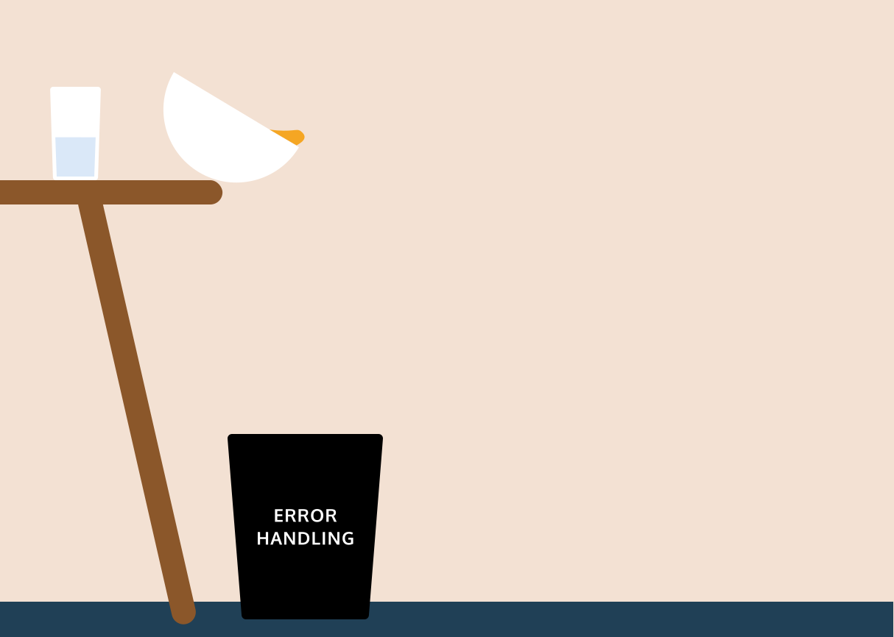

lesson link:

https://www.codecademy.com/journeys/full-stack-engineer/paths/fscj-22-front-end-development/tracks/fscj-22-javascript-syntax-part-iii/modules/wdcp-22-learn-javascript-syntax-error-handling-f3582f01-f40d-4726-aea0-4ea8ebd08eec/lessons/error-handling/exercises/intro-error-handling

### LEARN JAVASCRIPT: ERROR HANDLING

## Introduction to Error Handling

There are two categories of programming mistakes: those that don’t prevent our code from running and those that do.

Sometimes, we’ve written code that successfully returns a value but a different value from what we expected. Our program continues running, and we might not even realize anything went wrong until much later. It’s like making soup and accidentally adding sugar instead of salt. In the end we still have soup, but it might not be soup that we want to eat. We will not be focusing on these mistakes.

Rather, we’re going to focus on the errors that pop up when we’ve written code that causes our program to stop running, e.g. trying to reassign a const variable. Instead of returning anything, our program will not execute any more code past where the error occurred. For example, what if we tried to move our soup to the table but dropped it because it was too hot? Then our soup-making process is over— there would be no soup.

We can’t always stop errors before they occur, but we can include a backup plan in our program to anticipate and respond to the errors to ensure that our program continues running. Error handling is the process of programmatically anticipating and addressing errors. In JavaScript, we handle errors using the keywords try and catch. We try to move the soup to the table, making sure there’s someone or something nearby to catch the soup in case we drop it.

In this lesson we’ll learn more about errors and how to create a backup plan to allow our program to continue running. When you’re ready, let’s try to get a handle on these JavaScript errors!

