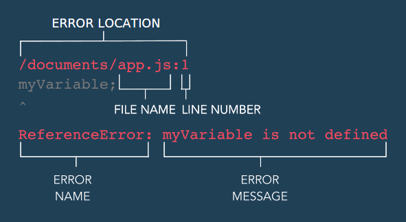

### LEARN JAVASCRIPT: ERROR HANDLING

## Runtime Errors

Errors contain useful messages that tell us why our program isn’t working or why the error was thrown. When an error is thrown, our program stops running and the console displays the error message in red text like so:

